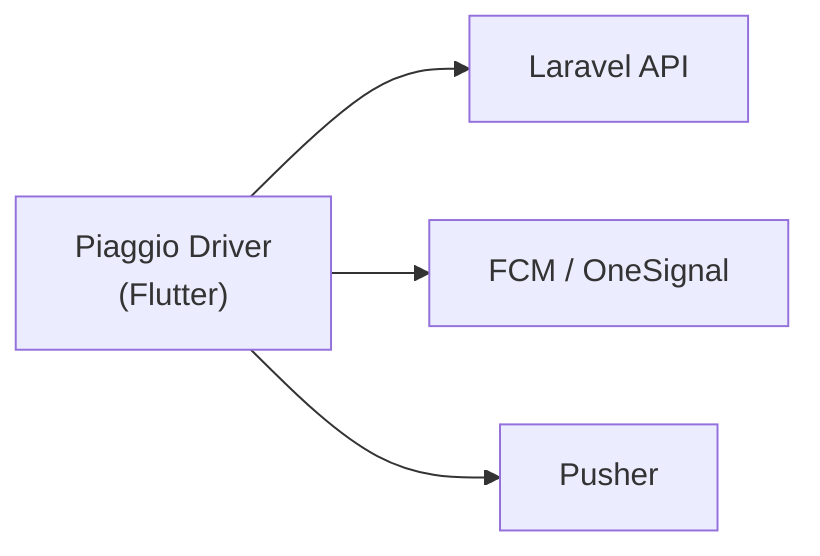

<h1 align="center">Piaggio Driver</h1>

<p align="center">
  <a href="https://dart.dev/"></a>
  &nbsp;
  <a href="https://flutter.dev/"></a>
  &nbsp;
  <a href="https://docs.flutter.dev/"></a>
  &nbsp;
  
</p>

<p align="center"><strong>تطبيق السائق — منصة Piaggio</strong></p>

> تطبيق **Flutter** للسائقين: تسجيل الدخول، استقبال الطلبات، التتبع، المحفظة والإحصائيات، مع خرائط وإشعارات فورية (GetX، Firebase، OneSignal، Pusher).

---

## لمحة سريعة

| الحقل      | القيمة                                         |
| :--------- | :--------------------------------------------- |
| **الحزمة** | `piaggio_driver`                               |
| **الإصدار** | `1.0.0+1` (من [`pubspec.yaml`](pubspec.yaml)) |
| **الحالة** | `publish_to: 'none'` — استخدام داخلي         |

---

## تدفق الخدمات



---

<details>
<summary><strong>فهرس المحتويات</strong></summary>

1. [لمحة سريعة](#لمحة-سريعة)
2. [تدفق الخدمات](#تدفق-الخدمات)
3. [المتطلبات](#المتطلبات)
4. [التشغيل السريع](#التشغيل-السريع)
5. [بنية المشروع](#بنية-المشروع)
6. [الميزات](#الميزات)
7. [الإعداد والتكوين](#الإعداد-والتكوين)
8. [الاعتماديات](#الاعتماديات)
9. [الاختبارات](#الاختبارات)
10. [النشر](#النشر)

</details>

---

## المتطلبات

| البند            | التفاصيل                                                                             |
| :--------------- | :----------------------------------------------------------------------------------- |
| **Flutter**      | متوافق مع **Dart SDK ^3.6.1** — راجع `environment` في [`pubspec.yaml`](pubspec.yaml) |
| **أدوات البناء** | Xcode (iOS) · Android Studio / SDK (Android)                                         |
| **Firebase**     | مشروع مفعّل ومربوط بالتطبيق — راجع [الإعداد والتكوين](#الإعداد-والتكوين)             |

---

## التشغيل السريع

| الخطوة       | الأمر             |
| :----------- | :---------------- |
| 1 — التبعيات | `flutter pub get` |
| 2 — التشغيل  | `flutter run`     |

من جذر المشروع (المجلد الذي يحتوي `pubspec.yaml`):

```bash
cd "piaggio_driver"   # أو اسم مجلد المشروع عندك
flutter pub get
flutter run
```

**بناء إصدار**

```bash
flutter build apk    # Android
flutter build ios    # iOS (يتطلب macOS)
```

---

## بنية المشروع

| المسار                                             | الدور                                                                            |
| :------------------------------------------------- | :------------------------------------------------------------------------------- |
| [`lib/main.dart`](lib/main.dart)                   | نقطة الدخول: Firebase، الإشعارات، `GetMaterialApp`، الربط الأولي للـ controllers |
| [`lib/routes/routes.dart`](lib/routes/routes.dart) | مسارات GetX (البداية، الترحيب، الرئيسية)                                         |
| `lib/constants/`                                   | أبعاد الواجهة، الألوان، عناوين الـ API، أدوات جغرافية                            |
| `lib/logic/controller/`                            | منطق الشاشات وحالة التطبيق (GetX)                                                |
| `lib/services/`                                    | الاتصال بالخادم، Pusher، الإشعارات، التخزين                                      |
| `lib/views/`                                       | واجهات المستخدم (مصادقة، طلبات، محفظة، إعدادات، …)                               |
| `lib/model/`                                       | نماذج البيانات                                                                   |
| `lib/widgets/`                                     | مكوّنات قابلة لإعادة الاستخدام                                                   |
| `assets/`                                          | صور، Lottie، خط **Almarai**                                                      |

---

## الميزات

| المجال           | ما يوفّره التطبيق                                                     |
| :--------------- | :-------------------------------------------------------------------- |
| **المصادقة**     | تسجيل دخول، تسجيل متعدد الخطوات، OTP، نسيان كلمة المرور               |
| **الطلبات**      | طلبات الشحن، قبول/رفض، تتبع، السجل                                    |
| **الموقع**       | Google Maps، OpenStreetMap (`flutter_map`)، `geolocator` / `location` |
| **الإشعارات**    | FCM، إشعارات محلية، OneSignal                                         |
| **الوقت الفعلي** | Pusher مع تفويض البث في الثوابت                                       |
| **المحفظة**      | رصيد، سجلات، إحصائيات ومخططات (`fl_chart`)                            |
| **أخرى**         | عروض، أنواع شحن، بيانات المركبة والمستندات، واجهة عربية (خط Almarai)  |

---

## الإعداد والتكوين

<details>
<summary><strong>1 — الخادم وعناوين الـ API</strong></summary>

القيم في [`lib/constants/api_Url.dart`](lib/constants/api_Url.dart) (API، صور، تفويض Pusher).  
عدّلها حسب بيئة التطوير أو الإنتاج.

</details>

<details>
<summary><strong>2 — Firebase</strong></summary>

يُستخدم `firebase_core`، `firebase_messaging`، `firebase_app_installations`.  
تأكد من [`lib/firebase_options.dart`](lib/firebase_options.dart) وملفات Android/iOS.

```bash
dart pub global activate flutterfire_cli
flutterfire configure
```

</details>

<details>
<summary><strong>3 — OneSignal</strong></summary>

`OneSignal.initialize(...)` في [`lib/services/appServices.dart`](lib/services/appServices.dart).  
للمشروع الجديد: استبدل المعرف بمعرّف تطبيقك.

</details>

<details>
<summary><strong>4 — الأصول والخطوط</strong></summary>

في [`pubspec.yaml`](pubspec.yaml): `assets/images/`، `assets/lottie/`، خط **Almarai** تحت `assets/fonts/`.

</details>

<details>
<summary><strong>5 — أيقونة التطبيق</strong></summary>

`flutter_launcher_icons` يشير إلى `assets/images/piaggio.jpg`. بعد تغيير الصورة، ولّد الأيقونات حسب إعدادات الحزمة في `pubspec.yaml`.

</details>

---

## الاعتماديات

<details>
<summary><strong>عرض حسب الفئة</strong> (انقر للتوسيع)</summary>

| الفئة           | الحزم                                                                                                  |
| :-------------- | :----------------------------------------------------------------------------------------------------- |
| **حالة وتنقل**  | `get`                                                                                                  |
| **تخزين**       | `get_storage`                                                                                          |
| **خرائط ومكان** | `google_maps_flutter`, `flutter_map`, `geolocator`, `location`, `permission_handler`                   |
| **إشعارات**     | `firebase_messaging`, `onesignal_flutter`, `flutter_local_notifications`                               |
| **واجهة**       | `lottie`, `shimmer`, `custom_refresh_indicator`, `pinput`, `infinite_scroll_pagination`, `dotted_line` |

القائمة الكاملة في [`pubspec.yaml`](pubspec.yaml).

</details>

---

## الاختبارات

```bash
flutter test
```

---

## النشر

`publish_to: 'none'` في [`pubspec.yaml`](pubspec.yaml) — المشروع للاستخدام الداخلي وليس للنشر على pub.dev.

---

<p align="center">
  <a href="https://docs.flutter.dev/">توثيق Flutter</a>
</p>
